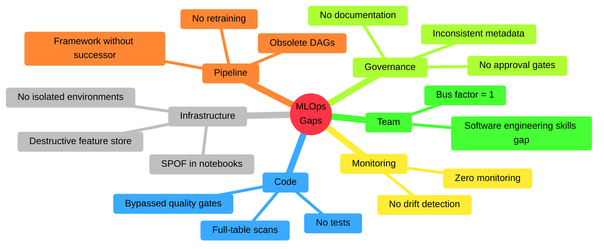
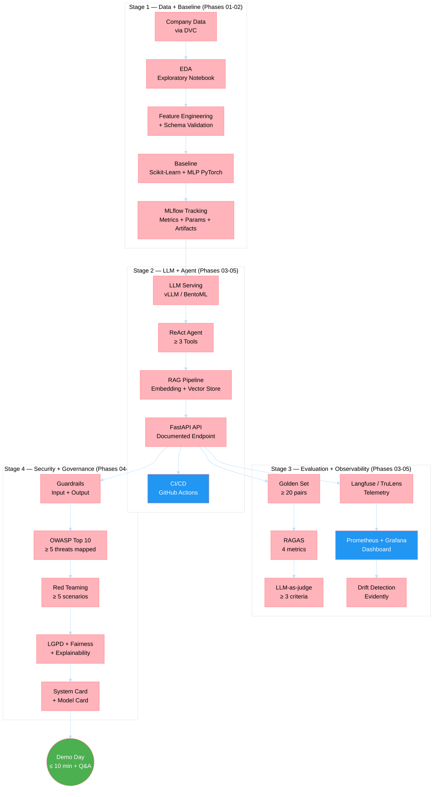
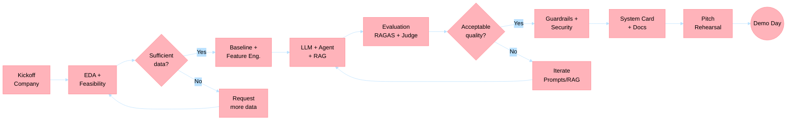
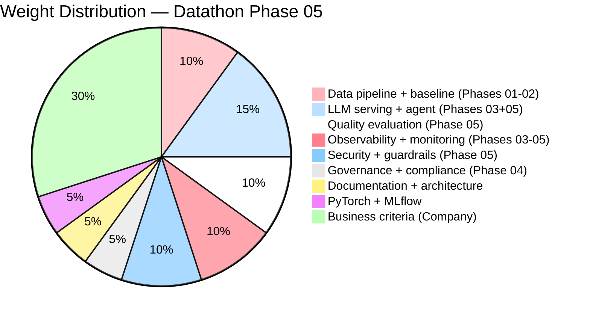

# Datathon — Phase 05 Challenge Development Guide

> **Phase**: 05 — LLMs and Agents
> **Format**: Datathon with Guest Company
> **Type**: Integrative Project (Phases 01–05)
> **Canonical reference**: [`fases/fase-05-llms-e-agentes/governanca-da-fase/tech-challenge.md`](../../fases/fase-05-llms-e-agentes/governanca-da-fase/tech-challenge.md)

---

## Why This Guide Exists

The Phase 05 Tech Challenge is the **Datathon**: a technical competition based on a real problem provided by a guest company. Unlike previous challenges, the problem statement comes from industry and the evaluation is composed of a mixed panel (company + academia).

This development guide translates the **most frequent gaps observed in financial market ML platforms** into practical guidance for groups facing the Datathon. The goal is to anticipate architectural, engineering, and governance pitfalls that real teams make — and that the evaluation panel will assess.

The content is based on MLOps maturity assessments conducted at regulated financial institutions and structured with the same standards as the `mlet` repository.

---

## MLOps Maturity — What the Panel Expects

The panel evaluates whether the group has reached **at least Level 2** of the Microsoft MLOps Maturity Model across critical dimensions:

| Dimension | Level 0 (unacceptable) | Level 1 (minimum) | Level 2 (expected) |
|---|---|---|---|
| Experiment Management | No tracking | Manual MLflow, inconsistent metadata | Standardized MLflow, metrics + params + artifacts |
| Model Management | No registry | Manual registration without lineage | Model Registry with versioning and mandatory metadata |
| CI/CD | No pipeline | Manual pipeline, no gates | GitHub Actions: lint → test → build → deploy (staging) |
| Monitoring | No observability | Basic logs | Metrics, drift detection, dashboard, alerts |
| Data Management | Loose data | Manually copied data | DVC/Delta Lake, versioning, synthetic data in dev |
| Feature Management | No feature store | Single-model feature store | Shared features, incremental materialization |

> **Tip**: The technical evaluation (70%) focuses on demonstrating accumulated maturity. Even if the final model has modest metrics, a well-governed architecture will score higher than a good model running ad-hoc.

---

## Common Gaps in ML Platforms — What to Avoid

### Taxonomy of Observed Gaps

The gaps below are derived from real assessments of ML platforms at financial institutions. Each gap includes the anti-pattern, the impact, and the recommendation for the Datathon.



---

### GAP 01: Lack of Model Monitoring

**Anti-pattern**: Model is deployed and never checked again. Nobody knows if it's performing well or poorly.

**Why it matters for the Datathon**: Stage 3 requires an observability dashboard with technical and business metrics. Delivering a model without monitoring is the equivalent of delivering a car without a dashboard.

**Recommendation**:
- Prometheus + Grafana for operational metrics (latency, throughput, errors)
- Langfuse or TruLens for LLM quality metrics (faithfulness, relevancy)
- Evidently for drift detection on features/predictions
- Automatic alerts for degradation

**Competencies mobilized**: Phase 03 (Prometheus/Grafana), Phase 04 (drift, observability), Phase 05 (LLMOps telemetry)

---

### GAP 02: Shared Notebook as SPOF

**Anti-pattern**: A single notebook is the production trigger for multiple models. One edit breaks everything.

**Real evidence**: At a financial institution, a scientist edited the shared notebook. Their model ran. All others stopped. The MLE received 30+ alerts over the weekend.

**Why it matters for the Datathon**: The panel penalizes high blast radius. If the group's pipeline has a single point of failure, the architecture score will be affected.

**Recommendation**:
- Each pipeline component should be isolated (separate jobs/tasks)
- Use declarative DAGs or workflows (Airflow, Prefect, Databricks Asset Bundles)
- Isolated compute per job — never share clusters between unrelated pipelines
- Everything versioned in Git with deployment via CI/CD

**Competencies mobilized**: Phase 02 (Docker, reproducible pipeline), Phase 03 (CI/CD)

---

### GAP 03: Feature Store with Destructive Pattern (Full-Flush)

**Anti-pattern**: Feature store (Redis, cache) with a "delete everything, load everything, always" strategy. During the flush window, the store is empty.

**Real evidence**: In a fraud detection system, every 10–55 minutes the entire cache was deleted and reloaded. During the empty window, transactions were processed without features — systematically wrong decisions.

**Why it matters for the Datathon**: If the group uses a feature store or context cache for RAG, the update strategy must be incremental, not destructive.

**Recommendation**:
- Incremental upsert (HSET/MSET with TTL) instead of FLUSHALL + bulk load
- Change Data Feed (Delta) or timestamps to process only deltas
- Never have an empty store window — this is unacceptable in production

**Competencies mobilized**: Phase 02 (feature engineering), Phase 03 (deployment and serving)

---

### GAP 04: Near-Zero Test Coverage

**Anti-pattern**: Quality gate configured with trivial thresholds (1% coverage). Team bypasses SonarQube by excluding folders. Nobody knows what pytest is.

**Real evidence**: In an ML team, test coverage was at 1%. When asked, the answer was: "they don't even know what pytest is." An engineer edited the SonarQube config file to exclude their directory.

**Why it matters for the Datathon**: The rubric requires functional pytest (Phases 01-02), CI/CD with tests (Phase 03), and data validation (Phase 04). Code without tests = low scores on Pipeline + Architecture + Documentation.

**Recommendation**:
- `pytest` with `--cov-fail-under=60` at minimum
- Schema tests with `pandera` or `great_expectations`
- Feature engineering tests: input/output shapes, nulls, ranges
- Inference tests: determinism, prediction range, count match
- Integration tests for endpoints (FastAPI TestClient)

**Competencies mobilized**: Phase 01 (fundamentals), Phase 02 (clean code, Docker), Phase 03 (CI/CD)

---

### GAP 05: No Model Versioning Governance

**Anti-pattern**: Each scientist logs different information in MLflow — or nothing. No standardized tags, no lineage, no approval workflow.

**Real evidence**: In a platform with 20+ models, it was impossible to answer: "Which version is in production? What data was it trained on? Who approved it?"

**Why it matters for the Datathon**: Stage 4 requires Model Card / System Card. Without standardized metadata, the Model Card will be generic and governance weak.

**Recommendation**:
```python
# Minimum required schema for model registration
required_tags = {
    "model_name": str,         # Model name
    "model_version": str,      # Semantic version
    "model_type": str,         # classification, regression, generation
    "training_data_version": str,  # Hash or DVC version
    "metrics": dict,           # {"auc": 0.95, "f1": 0.88}
    "owner": str,              # Owner email
    "risk_level": str,         # low, medium, high, critical
    "fairness_checked": bool,  # Bias audit done?
    "git_sha": str,            # Code commit
}
```

**Competencies mobilized**: Phase 04 (governance, LGPD), Phase 05 (System Card)

---

### GAP 06: No Drift Detection

**Anti-pattern**: Model deployed and forgotten. No data drift or concept drift verification. Degradation happens silently.

**Why it matters for the Datathon**: Stage 3 requires "Drift detection implemented and documented." It's an explicit acceptance criterion.

**Recommendation**:
- Evidently for drift reporting (data + prediction)
- PSI (Population Stability Index) as the primary metric
- Threshold: PSI > 0.1 = warning, PSI > 0.2 = retrain trigger
- Integrate with MLflow: log drift metrics alongside model metrics

```python
from evidently.report import Report
from evidently.metric_preset import DataDriftPreset

report = Report(metrics=[DataDriftPreset()])
report.run(reference_data=train_df, current_data=prod_df)

drift_result = report.as_dict()
drift_share = drift_result["metrics"][0]["result"]["share_of_drifted_columns"]
```

**Competencies mobilized**: Phase 04 (drift, observability), Phase 05 (LLMOps)

---

### GAP 07: No Automated Retraining

**Anti-pattern**: Models retrained manually, ad-hoc, without scheduled triggers. In some cases, each prediction retrains the model (training-inference coupling).

**Why it matters for the Datathon**: Demonstrating champion-challenger evaluation shows MLOps maturity significantly above average.

**Recommendation**:
- Scheduled retraining (cron) as baseline
- Event-driven retraining (drift detected → trigger pipeline)
- Champion-challenger validation before promotion:
  - Load champion from Model Registry
  - Train challenger with new data
  - Compare metrics on holdout set
  - Only promote if `delta_auc >= 0.005` (0.5% improvement)
- Human-in-the-loop: approval gate before production

**Competencies mobilized**: Phase 03 (CI/CD), Phase 04 (monitoring), Phase 05 (feedback loops)

---

### GAP 08: Development Environment without Data

**Anti-pattern**: Dev environment exists but contains no data. All testing happens in production.

**Real evidence**: An ML team had Databricks dev configured but there was no data there. Result: every code change was tested directly in production.

**Why it matters for the Datathon**: The rubric requires a reproducible pipeline (DVC + Docker). If the group doesn't have versioned and accessible data for reproduction, they lose points on Data Management.

**Recommendation**:
- `DVC` for data versioning (don't commit data to Git)
- Synthetic data for local tests (SDV, Faker, fixtures)
- Anonymized data for staging (Presidio for PII, if applicable)
- `make data` script that reproduces local environment with test data

**Competencies mobilized**: Phase 02 (DVC, versioning), Phase 04 (LGPD, anonymization)

---

### GAP 09: Software Engineering Skills Gap

**Anti-pattern**: Data scientists without programming fundamentals: unfamiliar with tests, type hints, error handling, Git flow. Actively resist quality controls.

**Why it matters for the Datathon**: The "Documentation and architecture" rubric (5%) and "Data pipeline and baseline" (10%) evaluate code quality. `pyproject.toml`, type hints, docstrings, structured logging are expected skills.

**Recommendation**:
```python
# Minimum quality standard for the Datathon:

# 1. Type hints on all functions
def compute_features(df: pd.DataFrame, target_col: str) -> pd.DataFrame:
    ...

# 2. Docstrings with Args and Returns
def train_model(X: pd.DataFrame, y: pd.Series) -> tuple[Any, dict[str, float]]:
    """Train model and return artifact + metrics.

    Args:
        X: Training features.
        y: Target.

    Returns:
        Tuple (trained model, metrics dictionary).
    """
    ...

# 3. Structured logging (never print)
import logging
logger = logging.getLogger(__name__)
logger.info("Training completed: AUC=%.4f", metrics["auc"])

# 4. pyproject.toml with managed dependencies
# 5. .env for secrets (never hardcoded)
```

**Competencies mobilized**: Phase 01 (fundamentals), Phase 02 (clean code, SOLID)

---

## Reference Architecture for the Datathon

The diagram below shows the expected architecture for a complete Datathon delivery, integrating all 5 phases:



---

## Recommended Development Process



---

## Recommended Repository Structure

```
datathon-group-XX/
├── .github/
│   └── workflows/
│       └── ci.yml                     # GitHub Actions: lint + test + build
├── data/
│   ├── raw/                           # Raw data (DO NOT commit, use DVC)
│   ├── processed/                     # Processed data
│   └── golden_set/                    # ≥ 20 pairs (query, expected, contexts)
├── src/
│   ├── features/
│   │   ├── __init__.py
│   │   └── feature_engineering.py     # Feature transformations
│   ├── models/
│   │   ├── __init__.py
│   │   ├── baseline.py                # Scikit-Learn + MLP PyTorch
│   │   └── train.py                   # Training pipeline with MLflow
│   ├── agent/
│   │   ├── __init__.py
│   │   ├── react_agent.py             # ReAct agent
│   │   ├── tools.py                   # ≥ 3 custom tools
│   │   └── rag_pipeline.py            # RAG: embedding + retriever + generator
│   ├── serving/
│   │   ├── __init__.py
│   │   ├── app.py                     # FastAPI endpoint
│   │   └── Dockerfile                 # Serving container
│   ├── monitoring/
│   │   ├── __init__.py
│   │   ├── drift.py                   # Evidently drift detection
│   │   └── metrics.py                 # Prometheus custom metrics
│   └── security/
│       ├── __init__.py
│       ├── guardrails.py              # Input/output guardrails
│       └── pii_detection.py           # Presidio PII detection
├── tests/
│   ├── conftest.py                    # Shared fixtures
│   ├── test_features.py               # Feature tests
│   ├── test_models.py                 # Model tests
│   ├── test_agent.py                  # Agent tests
│   ├── test_api.py                    # Endpoint tests
│   └── test_guardrails.py            # Security tests
├── evaluation/
│   ├── ragas_eval.py                  # RAGAS: 4 metrics
│   ├── llm_judge.py                   # LLM-as-judge: ≥ 3 criteria
│   └── ab_test_prompts.py            # A/B prompt testing
├── docs/
│   ├── MODEL_CARD.md                  # Model Card
│   ├── SYSTEM_CARD.md                 # System Card
│   ├── LGPD_PLAN.md                   # LGPD compliance plan
│   ├── OWASP_MAPPING.md              # ≥ 5 threats mapped
│   └── RED_TEAM_REPORT.md            # ≥ 5 adversarial scenarios
├── notebooks/
│   └── 01_eda.ipynb                   # Exploratory EDA
├── configs/
│   ├── model_config.yaml              # Hyperparameters
│   └── monitoring_config.yaml         # Drift thresholds
├── docker-compose.yml                 # Local orchestration
├── dvc.yaml                           # DVC pipeline
├── pyproject.toml                     # Dependencies (Poetry/uv)
├── Makefile                           # Shortcuts: make train, make serve, make test
├── .env.example                       # Environment variables template
├── .pre-commit-config.yaml            # Quality hooks
└── README.md                          # Main documentation
```

---

## Code Examples Aligned with the Datathon

### Standardized MLflow Tracking (Stage 1)

```python
# src/models/train.py
"""Training pipeline with standardized MLflow tracking."""
import logging

import mlflow
import pandas as pd
from sklearn.metrics import (
    f1_score,
    precision_score,
    recall_score,
    roc_auc_score,
)
from sklearn.model_selection import train_test_split

logger = logging.getLogger(__name__)


def train_and_log(
    df: pd.DataFrame,
    target_col: str,
    model_name: str,
    model_class,
    model_params: dict,
    test_size: float = 0.2,
    random_state: int = 42,
) -> str:
    """Train model, log everything to MLflow, return run_id.

    Args:
        df: DataFrame with features and target.
        target_col: Target column name.
        model_name: Name for MLflow registration.
        model_class: Model class (e.g., RandomForestClassifier).
        model_params: Model hyperparameters.
        test_size: Test proportion.
        random_state: Seed for reproducibility.

    Returns:
        MLflow experiment run_id.
    """
    X = df.drop(columns=[target_col])
    y = df[target_col]
    X_train, X_test, y_train, y_test = train_test_split(
        X, y, test_size=test_size, random_state=random_state, stratify=y
    )

    with mlflow.start_run(run_name=model_name) as run:
        # Log parameters
        mlflow.log_params(model_params)
        mlflow.log_param("test_size", test_size)
        mlflow.log_param("random_state", random_state)
        mlflow.log_param("n_features", X_train.shape[1])
        mlflow.log_param("n_samples_train", X_train.shape[0])

        # Standardized tags (required)
        mlflow.set_tag("model_type", "classification")
        mlflow.set_tag("framework", model_class.__module__.split(".")[0])
        mlflow.set_tag("owner", "group-XX")
        mlflow.set_tag("phase", "datathon-phase05")

        # Training
        model = model_class(**model_params)
        model.fit(X_train, y_train)
        y_pred = model.predict(X_test)

        # Standardized metrics
        metrics = {
            "auc": roc_auc_score(y_test, y_pred),
            "precision": precision_score(y_test, y_pred, zero_division=0),
            "recall": recall_score(y_test, y_pred, zero_division=0),
            "f1": f1_score(y_test, y_pred, zero_division=0),
        }
        mlflow.log_metrics(metrics)

        # Log model
        mlflow.sklearn.log_model(model, "model")

        logger.info(
            "Model %s trained: AUC=%.4f, F1=%.4f",
            model_name,
            metrics["auc"],
            metrics["f1"],
        )

        return run.info.run_id
```

### Standardized Tests (Stage 1)

```python
# tests/conftest.py
"""Shared fixtures for tests."""
import pandas as pd
import pytest


@pytest.fixture
def sample_data() -> pd.DataFrame:
    """Synthetic data for tests (never real data)."""
    return pd.DataFrame({
        "feature_1": [0.1, 0.5, 0.9, 0.3, 0.7, 0.2, 0.8, 0.4],
        "feature_2": [1.0, 2.0, 3.0, 4.0, 5.0, 1.5, 3.5, 2.5],
        "feature_cat": ["A", "B", "A", "C", "B", "A", "C", "B"],
        "target": [0, 1, 1, 0, 1, 0, 1, 0],
    })


# tests/test_features.py
"""Feature engineering tests — schema contracts."""
import pandera as pa
from pandera import Column, DataFrameSchema

from src.features.feature_engineering import compute_features


FEATURE_SCHEMA = DataFrameSchema({
    "feature_1": Column(float, pa.Check.between(0, 1)),
    "feature_2": Column(float, pa.Check.gt(0)),
    "feature_1_x_feature_2": Column(float),
})


def test_schema_contract(sample_data):
    """Output features must respect the schema contract."""
    result = compute_features(sample_data)
    FEATURE_SCHEMA.validate(result)


def test_no_nulls(sample_data):
    """No feature can have null after transformation."""
    result = compute_features(sample_data)
    assert result.isnull().sum().sum() == 0


def test_row_count_preserved(sample_data):
    """Number of records must be preserved."""
    result = compute_features(sample_data)
    assert len(result) == len(sample_data)
```

### ReAct Agent with Tools (Stage 2)

```python
# src/agent/react_agent.py
"""ReAct agent with custom tools for the Datathon domain.

Reference: Yao et al. (2023) — ReAct: Synergizing Reasoning and Acting
            in Language Models. https://arxiv.org/abs/2210.03629
"""
import logging

from langchain.agents import AgentExecutor, create_react_agent
from langchain.prompts import PromptTemplate
from langchain_community.chat_models import ChatOpenAI
from langchain.tools import Tool

logger = logging.getLogger(__name__)

REACT_PROMPT = PromptTemplate.from_template("""You are a specialized assistant.
Use the available tools to answer questions.

Available tools:
{tools}

Use the format:
Thought: think about what to do
Action: tool_name
Action Input: input for the tool
Observation: tool result
... (repeat Thought/Action/Observation as needed)
Thought: I now know the final answer
Final Answer: answer to the user

Question: {input}
{agent_scratchpad}""")


def create_datathon_agent(
    tools: list[Tool],
    model_name: str = "gpt-4o-mini",
    temperature: float = 0.0,
) -> AgentExecutor:
    """Create ReAct agent for the Datathon.

    Args:
        tools: List of tools (≥ 3 required).
        model_name: LLM model to use.
        temperature: Generation temperature.

    Returns:
        Configured AgentExecutor.
    """
    if len(tools) < 3:
        logger.warning("Datathon requires ≥ 3 tools. Provided: %d", len(tools))

    llm = ChatOpenAI(model=model_name, temperature=temperature)
    agent = create_react_agent(llm=llm, tools=tools, prompt=REACT_PROMPT)

    return AgentExecutor(
        agent=agent,
        tools=tools,
        verbose=True,
        max_iterations=10,
        handle_parsing_errors=True,
    )
```

### RAGAS Evaluation (Stage 3)

```python
# evaluation/ragas_eval.py
"""RAG pipeline evaluation with RAGAS — 4 required metrics.

Reference: Es et al. (2024) — RAGAS: Automated Evaluation of Retrieval
            Augmented Generation. https://arxiv.org/abs/2309.15217
"""
import json
import logging

from datasets import Dataset
from ragas import evaluate
from ragas.metrics import (
    answer_relevancy,
    context_precision,
    context_recall,
    faithfulness,
)

logger = logging.getLogger(__name__)


def evaluate_rag_pipeline(
    golden_set_path: str,
    rag_fn,
) -> dict[str, float]:
    """Evaluate RAG pipeline against golden set.

    Args:
        golden_set_path: Path to JSON with golden set.
        rag_fn: Function that takes a query and returns
                (answer, contexts).

    Returns:
        Dictionary with 4 RAGAS metrics.
    """
    with open(golden_set_path) as f:
        golden_set = json.load(f)

    # Generate pipeline responses
    results = []
    for item in golden_set:
        answer, contexts = rag_fn(item["query"])
        results.append({
            "question": item["query"],
            "answer": answer,
            "contexts": contexts,
            "ground_truth": item["expected_answer"],
        })

    dataset = Dataset.from_list(results)

    # RAGAS evaluation — 4 required metrics
    scores = evaluate(
        dataset,
        metrics=[
            faithfulness,
            answer_relevancy,
            context_precision,
            context_recall,
        ],
    )

    metrics = {
        "faithfulness": scores["faithfulness"],
        "answer_relevancy": scores["answer_relevancy"],
        "context_precision": scores["context_precision"],
        "context_recall": scores["context_recall"],
    }

    logger.info("RAGAS scores: %s", metrics)
    return metrics
```

### Input and Output Guardrails (Stage 4)

```python
# src/security/guardrails.py
"""Security guardrails for agent input and output.

Reference: OWASP Top 10 for LLM Applications (2025)
            https://owasp.org/www-project-top-10-for-large-language-model-applications/
"""
import logging
import re

from presidio_analyzer import AnalyzerEngine
from presidio_anonymizer import AnonymizerEngine

logger = logging.getLogger(__name__)


class InputGuardrail:
    """Validates and sanitizes user input before sending to the LLM."""

    # Common prompt injection patterns
    INJECTION_PATTERNS = [
        r"ignore\s+(all\s+)?previous\s+instructions",
        r"you\s+are\s+now\s+a",
        r"system:\s*",
        r"<\|im_start\|>",
        r"\[INST\]",
        r"forget\s+(everything|all|your\s+instructions)",
    ]

    def __init__(self, allowed_topics: list[str] | None = None):
        self.allowed_topics = allowed_topics or []
        self._compiled_patterns = [
            re.compile(p, re.IGNORECASE) for p in self.INJECTION_PATTERNS
        ]

    def validate(self, user_input: str) -> tuple[bool, str]:
        """Validate user input.

        Args:
            user_input: User text.

        Returns:
            Tuple (is_valid, reason).
        """
        # Check 1: Prompt injection detection
        for pattern in self._compiled_patterns:
            if pattern.search(user_input):
                logger.warning("Prompt injection detected: %s", user_input[:100])
                return False, "Input blocked: suspicious pattern detected."

        # Check 2: Maximum length (prevent context stuffing)
        if len(user_input) > 4096:
            return False, "Input blocked: exceeds maximum length (4096 chars)."

        return True, "OK"


class OutputGuardrail:
    """Validates and sanitizes LLM output before returning to the user."""

    def __init__(self, language: str = "pt"):
        self.analyzer = AnalyzerEngine()
        self.anonymizer = AnonymizerEngine()
        self.language = language

    def sanitize(self, llm_output: str) -> str:
        """Remove PII from LLM output.

        Args:
            llm_output: Text generated by the LLM.

        Returns:
            Sanitized text.
        """
        results = self.analyzer.analyze(
            text=llm_output,
            language=self.language,
            entities=["PERSON", "EMAIL_ADDRESS", "PHONE_NUMBER", "BR_CPF"],
        )

        if results:
            logger.warning("PII detected in output: %d entities", len(results))
            anonymized = self.anonymizer.anonymize(
                text=llm_output,
                analyzer_results=results,
            )
            return anonymized.text

        return llm_output
```

### GitHub Actions CI (Stage 2)

```yaml
# .github/workflows/ci.yml
name: Datathon CI

on:
  push:
    paths: ['src/**', 'tests/**', 'evaluation/**']
  pull_request:
    paths: ['src/**', 'tests/**', 'evaluation/**']

jobs:
  quality:
    runs-on: ubuntu-latest
    permissions:
      contents: read
    steps:
      - uses: actions/checkout@v4

      - name: Setup Python
        uses: actions/setup-python@v5
        with:
          python-version: '3.11'
          cache: 'pip'
          cache-dependency-path: 'pyproject.toml'

      - name: Install dependencies
        run: pip install -e ".[dev]"

      - name: Lint (ruff)
        run: ruff check src/ tests/ evaluation/

      - name: Type check (mypy)
        run: mypy src/ --ignore-missing-imports

      - name: Security scan (bandit)
        run: bandit -r src/ -c pyproject.toml

      - name: Unit tests (pytest)
        run: |
          pytest tests/ -x \
            --cov=src \
            --cov-report=xml \
            --cov-fail-under=60 \
            --junitxml=test-results.xml

      - name: Upload test results
        if: always()
        uses: actions/upload-artifact@v4
        with:
          name: test-results
          path: |
            test-results.xml
            coverage.xml
```

---

## Final Delivery Checklist

Use this checklist as a guide before Demo Day:

### Stage 1 — Data + Baseline
- [ ] Documented EDA with relevant insights for the company problem
- [ ] Trained baseline with metrics reported in MLflow
- [ ] Versioned pipeline (DVC + Docker) and reproducible
- [ ] Business metrics mapped to technical metrics
- [ ] `pyproject.toml` with all dependencies

### Stage 2 — LLM + Agent
- [ ] LLM served via API with quantization applied
- [ ] Functional ReAct agent with ≥ 3 domain-relevant tools
- [ ] RAG returning relevant context from provided data
- [ ] Functional CI/CD pipeline (GitHub Actions)
- [ ] Documented benchmark with ≥ 3 configurations

### Stage 3 — Evaluation + Observability
- [ ] Golden set with ≥ 20 domain-relevant pairs
- [ ] RAGAS: 4 metrics calculated and reported
- [ ] LLM-as-judge with ≥ 3 criteria (including business criterion)
- [ ] Telemetry and dashboard working end-to-end
- [ ] Drift detection implemented and documented

### Stage 4 — Security + Governance
- [ ] OWASP mapping with ≥ 5 threats and mitigations
- [ ] Functional input and output guardrails
- [ ] ≥ 5 adversarial scenarios tested and documented
- [ ] LGPD plan applied to the real case
- [ ] Explainability and fairness documented
- [ ] Complete System Card

### Demo Day
- [ ] Pitch ≤ 10 min: Problem → Approach → Demo → Results → Impact
- [ ] Prior rehearsal with timer
- [ ] Backup: offline slides in case demo fails
- [ ] Preparation for technical and business Q&A

---

## Evaluation Weight Distribution



---

## References

### Academic
1. Yao, S. et al. (2023). _"ReAct: Synergizing Reasoning and Acting in Language Models"_. ICLR 2023. https://arxiv.org/abs/2210.03629
2. Es, S. et al. (2024). _"RAGAS: Automated Evaluation of Retrieval Augmented Generation"_. https://arxiv.org/abs/2309.15217
3. Breck, E. et al. (2017). _"The ML Test Score: A Rubric for ML Production Readiness and Technical Debt Reduction"_. IEEE BigData.
4. Mitchell, M. et al. (2019). _"Model Cards for Model Reporting"_. FAT* Conference.
5. Sculley, D. et al. (2015). _"Hidden Technical Debt in Machine Learning Systems"_. NeurIPS.

### Frameworks and Guides
6. Microsoft (2024). _"MLOps Maturity Model"_. Azure ML Documentation.
7. Google (2023). _"Rules of Machine Learning: Best Practices for ML Engineering"_.
8. Google (2023). _"Practitioners Guide to MLOps"_.
9. OWASP (2025). _"OWASP Top 10 for Large Language Model Applications"_. https://owasp.org/www-project-top-10-for-large-language-model-applications/

### Regulatory
10. Brazil (2018). _Law No. 13,709/2018 (LGPD)_ — Personal Data Protection.

### Reference Repositories
11. FIAP (2025). _MLET Post-Tech_ — Repository `mlet`. Phases 01–05.
12. FIAP (2025). _MLET Materials_ — Repository `Materiais-MLET`. Executable technical content.
